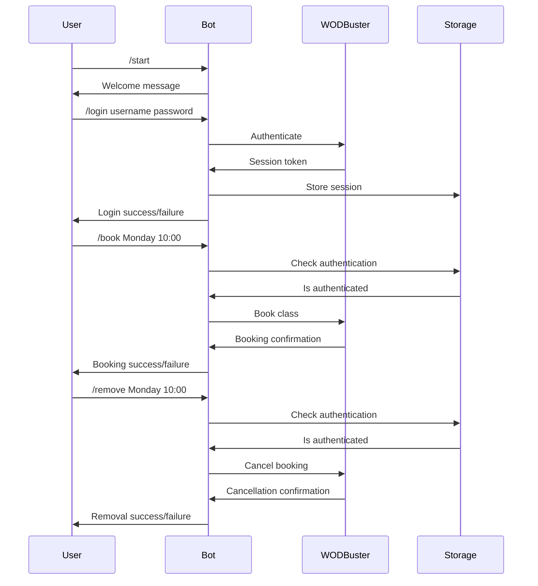

# WOD Buster Bot

[](https://github.com/MihaiLupoiu/wodbuster-bot/actions/workflows/ci.yaml)

A Telegram bot that automates the booking process for WODBuster fitness classes.

## Features

- User authentication via WODBuster credentials
- Class booking by day and time
- Booking cancellation
- Weekly schedule viewing
- Automated weekly schedule notifications (every Sunday at 00:00 UTC)

## Flow

1. User starts the bot with `/start`
2. User authenticates using `/login email password`
3. Once authenticated, user can:
   - View available classes (sent automatically every Sunday)
   - Book a class using `/book day hour`
   - Cancel a booking using `/remove day hour`
   - View commands with `/help`

## Architecture



## Setup

1. Get a Telegram Bot Token from BotFather
2. Create a `.env.dev` file with:
   ```
   TELEGRAM_BOT_TOKEN=your_token_here
   APP_ENV=dev
   LOGGING_LEVEL=DEBUG
   WODBUSTER_URL=https://wodbuster.com
   ```
3. Build and run:
   ```bash
   make build
   ./build/bot
   ```

## Development

### Build Commands
- Run tests: `make test`
- Run linter: `make lint`
- Build: `make build`
- Clean: `make clean`

### Testing
The project uses [mockery](https://github.com/vektra/mockery) to generate mocks for interfaces. Mocks are located in:
- `internal/telegram/handlers/mocks.go` - Mocks for handlers
- `internal/telegram/usecase/mocks.go` - Mocks for use cases

To regenerate mocks after interface changes:
```bash
go tool mockery
```

Test files follow these conventions:
- Use generated mocks from mockery instead of manual mocks
- Test files are located next to the code they test
- Follow table-driven test patterns

## Project Structure

```
.
├── cmd/
│   └── bot/              # Main application entry point
├── internal/
│   ├── app/             # Application core logic
│   ├── handlers/        # Command handlers
│   ├── models/          # Data models
│   ├── storage/         # Session storage
│   ├── telegram/        # Telegram bot implementation
│   └── wodbuster/       # WODBuster client
├── .env.dev            # Development environment variables
├── Dockerfile          # Container definition
├── go.mod             # Go modules file
├── go.sum             # Go modules checksums
└── Makefile           # Build commands
```
