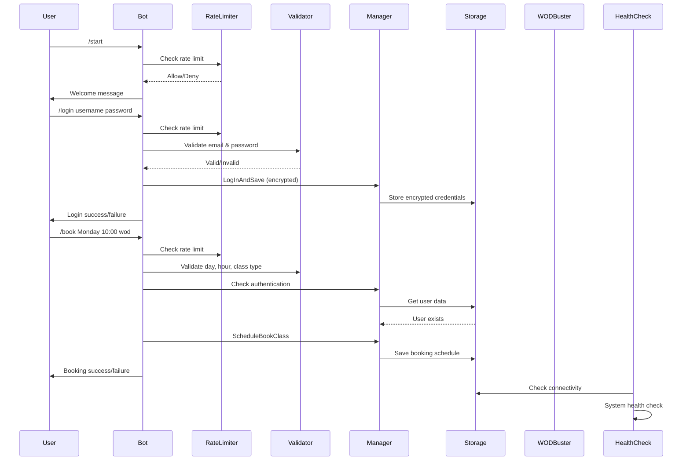

# WOD Buster Bot

[](https://github.com/MihaiLupoiu/wodbuster-bot/actions/workflows/ci.yaml)

A Telegram bot that automates the booking process for WODBuster fitness classes with enterprise-grade security and reliability features.

## Features

- User authentication via WODBuster credentials with encrypted password storage
- Class booking by day and time with comprehensive input validation
- Booking cancellation
- Weekly schedule viewing
- Automated weekly schedule notifications (every Sunday at 00:00 UTC)
- Rate limiting to prevent abuse
- Health check endpoints for monitoring
- Graceful shutdown handling
- Comprehensive logging and error handling

## Security Features

- **Password Encryption**: All passwords are encrypted using AES-GCM before storage
- **Input Validation**: Comprehensive validation for all user inputs (email, time, day, class type)
- **Rate Limiting**: Token bucket algorithm prevents command spam
- **Input Sanitization**: All inputs are sanitized to prevent injection attacks

## Flow

1. User starts the bot with `/start`
2. User authenticates using `/login email password`
3. Once authenticated, user can:
   - View available classes (sent automatically every Sunday)
   - Book a class using `/book day hour class-type`
   - Cancel a booking using `/remove day hour class-type`
   - View commands with `/help`

## Architecture



## Setup

1. Get a Telegram Bot Token from BotFather
2. Create a `.env.dev` file with:
   ```env
   TELEGRAM_BOT_TOKEN=your_token_here
   APP_ENV=dev
   LOGGING_LEVEL=DEBUG
   WODBUSTER_URL=https://wodbuster.com
   ENCRYPTION_KEY=your-32-character-secret-key123
   HEALTH_CHECK_PORT=8080
   APP_VERSION=1.0.0
   STORAGE_TYPE=memory
   MONGO_URI=mongodb://localhost:27017
   MONGO_DB=wodbuster
   ```
3. Build and run:
   ```bash
   make build
   ./build/bot -env=.env.dev
   ```

## Development

### Build Commands
- Run tests: `make test`
- Run linter: `make lint`
- Build: `make build`
- Clean: `make clean`
- Generate mocks: `make generate`

### Testing
The project uses comprehensive testing with:
- Unit tests for all utilities (validation, crypto, rate limiting)
- Integration testing with testcontainers
- Mocked dependencies using mockery
- Table-driven tests following Go best practices

### Health Checks
The application exposes health check endpoints:
- `GET /health` - Overall health status
- `GET /health/ready` - Readiness check
- `GET /health/live` - Liveness check

### Security Best Practices
- Passwords are encrypted using AES-GCM with random nonces
- All user inputs are validated and sanitized
- Rate limiting prevents abuse (5 requests per 10 seconds per user)
- Comprehensive error handling without information leakage
- Graceful shutdown with proper resource cleanup

## Project Structure

```
.
├── cmd/
│   └── bot/              # Main application entry point
├── internal/
│   ├── app/             # Application core logic & configuration
│   ├── health/          # Health check endpoints
│   ├── models/          # Data models
│   ├── storage/         # Session storage (memory/MongoDB)
│   ├── telegram/        # Telegram bot implementation
│   │   ├── handlers/    # Command handlers with validation
│   │   └── usecase/     # Business logic layer
│   ├── utils/           # Utilities (crypto, validation, rate limiting)
│   └── wodbuster/       # WODBuster client
├── .env.dev            # Development environment variables
├── Dockerfile          # Container definition
├── go.mod             # Go modules file
└── Makefile           # Build commands
```

## Environment Variables

| Variable | Description | Default |
|----------|-------------|---------|
| `TELEGRAM_BOT_TOKEN` | Telegram bot token from BotFather | Required |
| `APP_ENV` | Environment (dev/prod) | `prod` |
| `LOGGING_LEVEL` | Log level (DEBUG/INFO/WARN/ERROR) | `DEBUG` |
| `WODBUSTER_URL` | WODBuster website URL | `https://wodbuster.com` |
| `ENCRYPTION_KEY` | 32-character key for password encryption | Required |
| `HEALTH_CHECK_PORT` | Port for health check server | `8080` |
| `APP_VERSION` | Application version | `1.0.0` |
| `STORAGE_TYPE` | Storage type (memory/mongodb) | `memory` |
| `MONGO_URI` | MongoDB connection string | `mongodb://localhost:27017` |
| `MONGO_DB` | MongoDB database name | `wodbuster` |

## Docker Deployment

```bash
# Build image
docker build -t wodbuster-bot .

# Run with environment variables
docker run -e TELEGRAM_BOT_TOKEN=your_token wodbuster-bot

# Or use docker-compose
docker-compose up --build
```

## TODO:

### Basic Functionality
- [ ] Basic WoodBuster client implementation that is able to authenticate and book classes
- [ ] Have Manager to use the WoodBuster client to logIn and Book classes by storing the session cookie
- [ ] Implement the cron to execute the weekly schedule and book classes
- [ ] Implement Notifications for the weekly schedule booking if successful or failed
- [ ] Deploy the bot to a server
- [ ] Automatically deploy update of the code using GitHub Actions
  
### Advanced Functionality
- [ ] Implement a way to cancel bookings
- [ ] Implement a way to view the booked classes
- [ ] Improve Class Type options to be more user-friendly
- [ ] Use the API and not the chromedp to book classes
- [ ] Add metrics collection (Prometheus)
- [ ] Add distributed tracing
- [ ] Implement webhook for real-time booking updates