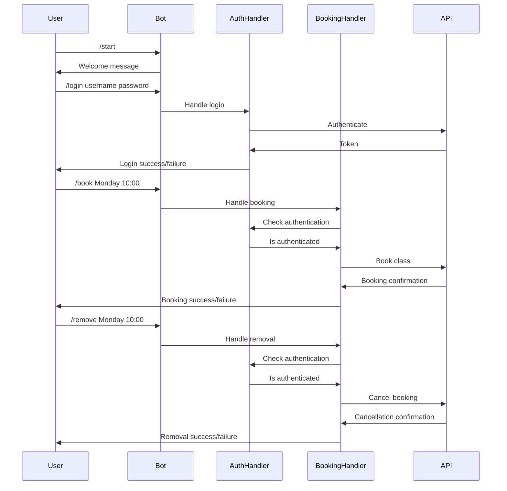

# Telegram Class Booking Bot

[](https://github.com/MihaiLupoiu/wodbuster-bot/actions/workflows/ci.yml)

A Telegram bot that allows users to book and manage fitness class schedules.

## Features

- User authentication
- Class booking by day and time
- Booking cancellation
- Weekly schedule viewing
- Automated weekly schedule notifications

## Flow

1. User starts the bot with `/start`
2. User authenticates using `/login username password`
3. Once authenticated, user can:
   - View available classes (sent automatically every Sunday)
   - Book a class using `/book day hour`
   - Cancel a booking using `/remove day hour`
   - View commands with `/help`

## Architecture



## Setup

1. Get a Telegram Bot Token from BotFather
2. Set the environment variable:
   ```bash
   export TELEGRAM_BOT_TOKEN=your_token_here
   ```
3. Build and run:
   ```bash
   make build
   ./build/bot
   ```

## Development

- Run tests: `make test`
- Run linter: `make lint`
- Generate mocks: `make generate`
- Build: `make build`
- Clean: `make clean`

## Project Structure

```
.
├── cmd/
│   └── bot/              # Main application
├── internal/
│   ├── handlers/         # Command handlers
│   ├── models/           # Data models
│   └── storage/          # Data storage
├── Dockerfile           # Container definition
├── go.mod              # Go modules file
├── go.sum              # Go modules checksums
└── Makefile            # Build commands
```
