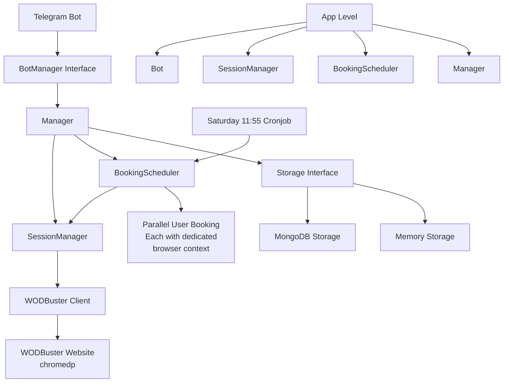

# 🤖 WODBuster Bot

A Telegram bot that automatically books fitness classes on WODBuster when booking opens every Saturday at 12:00 PM.

## ✨ **Features**

- 🔐 **Secure Authentication**: Login with your WODBuster credentials (encrypted storage)
- 📅 **Automated Booking**: Schedule classes to be booked automatically
- ⚡ **Multi-User Support**: Each user gets their own browser session for parallel booking
- 🍪 **Session Persistence**: Remembers your login using WODBuster session cookie
- ⏰ **Saturday Cronjob**: Runs every Saturday at 11:55 AM, ready to book at 12:00 PM
- 🧪 **Session Testing**: Verify your login status anytime
- 📊 **Status Monitoring**: Track your scheduled classes and booking attempts

## 🏗️ **Architecture**


```mermaid
graph TB
    A[Telegram Bot] --> B[BotManager Interface]
    B --> C[Manager]
    C --> D[SessionManager]
    C --> E[BookingScheduler]
    C --> F[Storage Interface]
    
    D --> G[WODBuster Client]
    E --> D
    F --> H[MongoDB Storage]
    F --> I[Memory Storage]
    
    G --> J[WODBuster Website<br/>chromedp]
    
    K[App Level] --> L[Bot]
    K --> M[SessionManager]
    K --> N[BookingScheduler]
    K --> O[Manager]
    
    P[Saturday 11:55 Cronjob] --> E
    E --> Q[Parallel User Booking<br/>Each with dedicated<br/>browser context]
```

### Clean Architecture Principles

- **Dependency Injection**: All dependencies are created at app level and injected
- **Interface Segregation**: Bot only depends on `BotManager` interface methods it needs
- **Single Responsibility**: Each component has a clear, focused purpose
- **Separation of Concerns**: Business logic, storage, and UI are cleanly separated

### Package Structure

```
pkg/
└── wodbuster/              # Standalone WodBuster client — see pkg/wodbuster/README.md
    ├── browserauth/        # Login via headless Chrome (chromedp)
    ├── race/               # Waiting and polling policy
    └── wodbustertest/      # A fake WodBuster, for tests that cannot wait a week

cmd/
├── bot/                    # The Telegram bot
└── wodbook/                # The CLI that proves the library books

internal/
├── app/                    # Application orchestration
├── models/                 # Domain models (User, BookingAttempt, etc.)
├── telegram/               # Telegram bot interface
│   └── usecase/           # Business logic (Manager, SessionManager, BookingScheduler)
├── storage/               # Storage implementations (MongoDB, Memory)
└── wodbuster/             # Simple chromedp client wrapper (being replaced by pkg/wodbuster)
```

`pkg/wodbuster` is new and not yet wired into the bot. It exists because talking
to WodBuster and winning the rush when a week is published is a different kind
of problem from cron, Mongo and Telegram conversations — and only the first one
needs a Sunday to verify. `cmd/wodbook` exercises it end to end with nothing but
a binary and a terminal.

## 🚀 **Quick Start**

### Option 1: Docker (Recommended)

1. **Clone the repository**
   ```bash
   git clone https://github.com/MihaiLupoiu/wodbuster-bot.git
   cd wodbuster-bot
   ```

2. **Configure environment variables**
   ```bash
   cp .env.example .env
   # Edit .env with your values
   ```

3. **Run with Docker Compose**
   ```bash
   make docker-compose-run
   ```

### Option 2: Local Development

1. **Prerequisites**
   - Go 1.21+
   - MongoDB (optional, uses memory storage by default)
   - Chrome/Chromium browser

2. **Install dependencies**
   ```bash
   go mod download
   ```

3. **Run the bot**
   ```bash
   make run
   ```

## ⚙️ **Configuration**

Create a `.env` file with the following variables:

```env
# Required
TELEGRAM_BOT_TOKEN=your-telegram-bot-token-here
WODBUSTER_URL=https://wodbuster.com
ENCRYPTION_KEY=your-32-character-encryption-key-here

# Storage (optional, defaults to memory)
STORAGE_TYPE=mongodb
MONGO_URI=mongodb://localhost:27017
MONGO_DB=wodbuster

# Optional
LOG_LEVEL=info
HEALTH_CHECK_PORT=8080
VERSION=1.0.0
```

### Getting a Telegram Bot Token

1. Message [@BotFather](https://t.me/botfather) on Telegram
2. Use `/newbot` command
3. Follow the instructions
4. Copy your bot token

## 🎯 **Usage**

### User Commands

**Authentication:**
- `/start` - Welcome message and instructions
- `/login email password` - Login with your WODBuster credentials
- `/test` - Test your current session

**Booking:**
- `/book day hour class-type` - Schedule a class for automatic booking
  - Example: `/book Monday 10:00 wod`
  - Valid days: Monday, Tuesday, Wednesday, Thursday, Friday, Saturday, Sunday
  - Valid class types: wod, open, strength, cardio, yoga
- `/status` - Show your account status and scheduled classes
- `/active` - Show currently active booking attempts

**Help:**
- `/help` - Show all available commands

### Example Usage Flow

```
User: /login john@example.com mypassword
Bot: ✅ Login successful! Your session is ready.

User: /book Monday 10:00 wod  
Bot: ✅ Class scheduled successfully!
     📅 Monday 10:00 - wod
     The bot will automatically book this class on Saturday at 12:00 PM.

User: /status
Bot: 📊 Your Status
     Authentication: ✅ Authenticated
     Email: john@example.com
     Scheduled Classes: 1
     
     Scheduled Classes:
     • Monday 10:00 - wod
```

## 🏃 **`wodbook`: booking from the command line**

A standalone binary that books the moment a week is published, with no Telegram
and no database. Run it a few minutes before the opening; it authenticates,
synchronises with the server's clock, waits, and books.

```bash
make build-wodbook
cp cmd/wodbook/config.example.json config.json   # box, targets, timezone
export WODBUSTER_EMAIL=you@example.com           # the environment wins over
export WODBUSTER_PASSWORD='...'                  # the file, so nothing is committed

./build/wodbook -config config.json              # wait for the opening, then book
```

### Trying it now, without booking anything

```bash
make rehearse                                    # = -now -dry -v
```

`-dry` does everything except send the booking request. `-now` skips the wait
for the opening. Together they are a full dress rehearsal that can be run on any
day of the week: a real login, the real published schedule, the real class ids
resolved — and then it stops one request short of taking a place.

Keeping them as two flags is deliberate. `-now` alone answers "can it book?",
`-dry` alone answers "can it wait?". Those are different bugs, and finding out
about both at noon on a Sunday costs a week.

One catch worth knowing before the output confuses you: targets are written as a
recurring weekday and resolved to the **next** date that falls on it, so a
rehearsal must name a day the box has already published. Rehearsing on a Friday,
`saturday` works and `monday` does not — Monday belongs to the week that opens on
Sunday, so the run polls, never sees it, and exits with `race: day never
published`. That is correct behaviour, not a failure of the rehearsal.

> **The two halves of this repo disagree about the opening day.** The bot's cron
> is `55 11 * * 6` — Saturday 11:55 (`internal/telegram/usecase/scheduler.go:52`)
> — while `wodbook` defaults to Sunday 12:00, following the design doc. One of
> them is wrong about the real box, and whichever it is fires on a day when
> nothing publishes. Set `opens` in the config to whatever your box actually
> does, and see `todo.md`.

Full detail, including the exit codes and what a rehearsal still does not prove:
[`pkg/wodbuster/README.md`](pkg/wodbuster/README.md).

## ⏰ **How the Saturday Booking Works**

1. **11:55 AM**: Bot starts up and prepares all user sessions
2. **11:55-12:00**: Bot navigates to class schedule pages and waits
3. **12:00 PM**: Booking buttons become available
4. **12:00-12:05**: Bot attempts to book all scheduled classes in parallel
5. **Results**: Users are notified of success/failure via Telegram

## 🧪 **Testing**

### Run Unit Tests
```bash
make test
```

### Run Integration Tests
```bash
make test-integration
```

### The client library

`pkg/wodbuster` has no Mongo and no Telegram in it, so its tests need nothing
installed and no Sunday:

```bash
go test -race ./pkg/... ./cmd/wodbook/...
```

They run against `wodbustertest`, a fake WodBuster that speaks the real
protocol and can be told to publish late, run out of places, reject a booking or
expire a session — including the case that matters most and that no real Sunday
reproduces on demand: losing the race.

## 📊 **Database Schema**

### Users Collection
```json
{
  "chat_id": 123456789,
  "email": "user@example.com", 
  "password": "encrypted_password",
  "is_authenticated": true,
  "wodbuster_session_cookie": "session_cookie_value",
  "session_expires_at": "2023-12-10T12:00:00Z",
  "session_valid": true,
  "class_booking_schedules": [
    {
      "id": "unique_id",
      "day": "Monday",
      "hour": "10:00",
      "class_type": "wod"
    }
  ],
  "created_at": "2023-12-01T10:00:00Z",
  "updated_at": "2023-12-01T10:00:00Z"
}
```

### Booking Attempts Collection
```json
{
  "_id": "unique_booking_id",
  "chat_id": 123456789,
  "day": "Monday",
  "hour": "10:00",
  "class_type": "wod",
  "status": "pending",
  "attempt_time": "2023-12-09T12:00:00Z",
  "error_msg": "",
  "retry_count": 0,
  "created_at": "2023-12-01T10:00:00Z",
  "updated_at": "2023-12-01T10:00:00Z"
}
```

## 🔒 **Security Features**

- **Encrypted Passwords**: User passwords are encrypted before storage
- **Session Isolation**: Each user gets dedicated browser context
- **Rate Limiting**: Prevents command spam
- **No Sensitive Data in Logs**: Credentials are never logged
- **Secure Cookie Storage**: Only essential session cookie is stored

## 🐳 **Docker Support**

### Development
```bash
make docker-build
make docker-run
```

### Production
```bash
make docker-compose-up
```

## 🤝 **Contributing**

1. Fork the repository
2. Create your feature branch (`git checkout -b feature/amazing-feature`)
3. Commit your changes (`git commit -m 'Add amazing feature'`)
4. Push to the branch (`git push origin feature/amazing-feature`)
5. Open a Pull Request

## 📝 **License**

This project is licensed under the MIT License - see the [LICENSE](LICENSE) file for details.

## ⚠️ **Disclaimer**

This bot is for educational purposes. Please ensure you comply with WODBuster's terms of service when using automated booking tools.