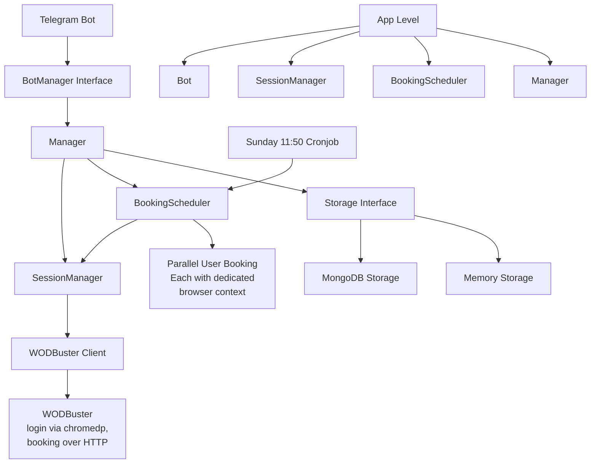

# 🤖 WODBuster Bot

A Telegram bot that automatically books fitness classes on WODBuster the moment the week opens, on Sunday at 12:00 (Europe/Madrid).

## ✨ **Features**

- 🔐 **Secure Authentication**: Login with your WODBuster credentials (encrypted storage)
- 📅 **Automated Booking**: Schedule classes to be booked automatically
- ⚡ **Multi-User Support**: Each user gets their own browser session for parallel booking
- 🍪 **Session Persistence**: Remembers your login using WODBuster session cookie
- ⏰ **Weekly run**: Wakes up ten minutes before the opening, logs in, syncs with the server's clock, and books the instant the week is published
- 🧪 **Session Testing**: Verify your login status anytime
- 📊 **Status Monitoring**: Track your scheduled classes and booking attempts

## 🏗️ **Architecture**


```mermaid
graph TB
    A[Telegram Bot] --> B[BotManager Interface]
    B --> C[Manager]
    C --> D[SessionManager]
    C --> E[BookingScheduler]
    C --> F[Storage Interface]
    
    D --> G[WODBuster Client]
    E --> D
    F --> H[MongoDB Storage]
    F --> I[Memory Storage]
    
    G --> J[WODBuster<br/>login via chromedp,<br/>booking over HTTP]
    
    K[App Level] --> L[Bot]
    K --> M[SessionManager]
    K --> N[BookingScheduler]
    K --> O[Manager]
    
    P[Sunday 11:50 Cronjob] --> E
    E --> Q[Parallel User Booking<br/>Each with dedicated<br/>browser context]
```

### Clean Architecture Principles

- **Dependency Injection**: All dependencies are created at app level and injected
- **Interface Segregation**: Bot only depends on `BotManager` interface methods it needs
- **Single Responsibility**: Each component has a clear, focused purpose
- **Separation of Concerns**: Business logic, storage, and UI are cleanly separated

### Package Structure

```
pkg/
└── wodbuster/              # Standalone WodBuster client — see pkg/wodbuster/README.md
    ├── browserauth/        # Login via headless Chrome (chromedp)
    ├── race/               # Waiting and polling policy
    └── wodbustertest/      # A fake WodBuster, for tests that cannot wait a week

internal/
└── booking/                # The bot's side of pkg/wodbuster: credentials + classes -> a run

cmd/
├── bot/                    # The Telegram bot
└── wodbook/                # The CLI that proves the library books

internal/
├── app/                    # Application orchestration
├── models/                 # Domain models (User, BookingAttempt, etc.)
├── telegram/               # Telegram bot interface
│   └── usecase/           # Business logic (Manager, SessionManager, BookingScheduler)
├── storage/               # Storage implementations (MongoDB, Memory)
└── wodbuster/             # Simple chromedp client wrapper (being replaced by pkg/wodbuster)
```

`pkg/wodbuster` is new and not yet wired into the bot. It exists because talking
to WodBuster and winning the rush when a week is published is a different kind
of problem from cron, Mongo and Telegram conversations — and only the first one
needs a Sunday to verify. `cmd/wodbook` exercises it end to end with nothing but
a binary and a terminal.

## 🚀 **Quick Start**

### Option 1: Docker (Recommended)

1. **Clone the repository**
   ```bash
   git clone https://github.com/MihaiLupoiu/wodbuster-bot.git
   cd wodbuster-bot
   ```

2. **Configure environment variables**
   ```bash
   cp .env.example .env
   # Edit .env with your values
   ```

3. **Run with Docker Compose**
   ```bash
   make docker-compose-run
   ```

### Option 2: Local Development

1. **Prerequisites**
   - Go 1.21+
   - MongoDB (optional, uses memory storage by default)
   - Chrome/Chromium browser

2. **Install dependencies**
   ```bash
   go mod download
   ```

3. **Run the bot**
   ```bash
   make run
   ```

## ⚙️ **Configuration**

Create a `.env` file with the following variables:

```env
# Required
TELEGRAM_BOT_TOKEN=your-telegram-bot-token-here
WODBUSTER_URL=https://wodbuster.com
ENCRYPTION_KEY=your-32-character-encryption-key-here

# Storage (optional, defaults to memory)
STORAGE_TYPE=mongodb
MONGO_URI=mongodb://localhost:27017
MONGO_DB=wodbuster

# Optional
LOG_LEVEL=info
HEALTH_CHECK_PORT=8080
VERSION=1.0.0
```

### Getting a Telegram Bot Token

1. Message [@BotFather](https://t.me/botfather) on Telegram
2. Use `/newbot` command
3. Follow the instructions
4. Copy your bot token

## 🎯 **Usage**

### User Commands

**Authentication:**
- `/start` - Welcome message and instructions
- `/login email password` - Login with your WODBuster credentials
- `/test` - Check that your stored credentials still log in
- `/rehearse` - Resolve your classes against the published week, booking nothing

**Booking:**
- `/book day hour class-type` - Schedule a class for automatic booking
  - Example: `/book Monday 10:00 wod`
  - Valid days: Monday, Tuesday, Wednesday, Thursday, Friday, Saturday, Sunday
  - Valid class types: wod, open, strength, cardio, yoga
- `/status` - Show your account status and scheduled classes
- `/active` - Show currently active booking attempts

**Help:**
- `/help` - Show all available commands

### Example Usage Flow

```
User: /login john@example.com mypassword
Bot: ✅ Login successful! Your session is ready.

User: /book Monday 10:00 wod  
Bot: ✅ Class scheduled successfully!
     📅 Monday 10:00 - wod
     The bot will book this class when the week opens, on Sunday at 12:00.

User: /status
Bot: 📊 Your Status
     Authentication: ✅ Authenticated
     Email: john@example.com
     Scheduled Classes: 1
     
     Scheduled Classes:
     • Monday 10:00 - wod
```

## 🏃 **`wodbook`: booking from the command line**

A standalone binary that books the moment a week is published, with no Telegram
and no database. Run it a few minutes before the opening; it authenticates,
synchronises with the server's clock, waits, and books.

```bash
make build-wodbook
cp cmd/wodbook/config.example.json config.json   # box, targets, timezone

# credentials go in the environment, never in config.json
cat >> .env <<'ENV'
WODBUSTER_EMAIL=you@example.com
WODBUSTER_PASSWORD=...
ENV

./build/wodbook -config config.json              # wait for the opening, then book
```

The config file holds *what* to book — a list of targets, which is a shape that
does not fit in environment variables. Credentials are separate: `./.env` is
picked up automatically, `-env other.env` names a different file, and an
exported variable beats both. Note the names are `WODBUSTER_EMAIL` and
`WODBUSTER_PASSWORD`; the older `cmd/script` reads `TEST_EMAIL` / `TEST_PASSWORD`
from the same file, so you may need both pairs for now.

### Trying it now, without booking anything

```bash
make rehearse                                    # = -now -dry -v
```

`-dry` does everything except send the booking request. `-now` skips the wait
for the opening. Together they are a full dress rehearsal that can be run on any
day of the week: a real login, the real published schedule, the real class ids
resolved — and then it stops one request short of taking a place.

Keeping them as two flags is deliberate. `-now` alone answers "can it book?",
`-dry` alone answers "can it wait?". Those are different bugs, and finding out
about both at noon on a Sunday costs a week.

One catch worth knowing before the output confuses you: targets are written as a
recurring weekday and resolved to the **next** date that falls on it, so a
rehearsal must name a day the box has already published. Rehearsing on a Friday,
`saturday` works and `monday` does not — Monday belongs to the week that opens on
Sunday, so the run polls, never sees it, and exits with `race: day never
published`. That is correct behaviour, not a failure of the rehearsal.

> **Settled:** firespain publishes on **Sunday at 12:00** Europe/Madrid,
> confirmed by live runs on 2026-09-20 and 2026-09-27. The bot and `wodbook`
> now agree; the bot's opening lives in one place,
> `usecase.DefaultOpening` (`internal/telegram/usecase/opening.go`).

Full detail, including the exit codes and what a rehearsal still does not prove:
[`pkg/wodbuster/README.md`](pkg/wodbuster/README.md).

## ⏰ **How the weekly run works**

1. **Sunday 11:50** — the cronjob wakes up, ten minutes before the opening.
2. One goroutine per athlete: each logs in with their own stored credentials
   (a browser, 3–15s), then syncs with WodBuster's own clock.
3. Each run reads the server's countdown and trusts it over the configured
   time when the two disagree by more than two seconds.
4. **12:00** — the chase: poll until the week appears, then book, retrying
   anything that is not a flat "no" until the class fills up, then taking the
   waiting list.
5. Results arrive in Telegram, per athlete.

Athletes do not slow each other down: WodBuster serialises booking calls per
athlete, not globally. Within one athlete the client queues its own calls, which
is what stops three classes from colliding with each other — see
[`pkg/wodbuster/README.md`](pkg/wodbuster/README.md).

## 📦 **Releasing**

```bash
make release bump=patch     # or minor, major; defaults to patch
```

That dispatches the `Release` workflow on `main`. It runs CI, then builds the
image for `linux/amd64` and `linux/arm64` and pushes it to Docker Hub, then
tags the commit and opens a GitHub release. The version is computed from the
tags already on `origin`, so nothing is tagged locally and two people cannot
pick the same number.

The image is pushed **before** the tag is created: a failed build leaves
nothing behind, whereas a tag with no image behind it has to be deleted by hand
before that version can be cut again.

Each release publishes three tags — `vX.Y.Z`, `X.Y.Z` and `latest` — and bakes
the version into `APP_VERSION`, so a running container can say which release it
is.

**One-time setup.** Under *Settings → Secrets and variables → Actions*:

| Name | Kind | Purpose |
|---|---|---|
| `DOCKERHUB_USERNAME` | secret | Docker Hub account |
| `DOCKERHUB_TOKEN` | secret | Docker Hub **access token**, not the password |
| `DOCKERHUB_IMAGE` | variable (optional) | Full image name; defaults to `<username>/wodbuster-bot` |

The workflow checks both secrets exist before it does anything else, so a
missing one fails in seconds rather than after the build.

**Running a release:**

```bash
WODBUSTER_IMAGE=<user>/wodbuster-bot:v1.2.3 docker compose up --no-build
```

## 📈 **Metrics**

Prometheus metrics are served at `/metrics` on the health port (8080), next to
`/health`, so the process keeps a single listener.

```
wodbuster_bot_commands_total{command="book"} 3
wodbuster_bot_commands_total{command="(others)"} 1
```

The shape follows `buying-engine-service`: one explicit registry rather than the
default one, collectors built with `promauto.With(reg)`, and `Observe*` methods
on a struct that callers hold. Nothing reads a package-level global, so a test
builds its own registry and asserts on it.

26 metrics across four packages: the weekly run (did it happen, how late, what
it booked), WodBuster itself (requests, login, clock offset, control drift), the
Mongo client (via the driver's own event monitors) and Telegram (commands,
updates, replies). [`docs/monitoring.md`](docs/monitoring.md) lists them all
with the reasoning, and the alerts worth building on top. Adding a metric means adding a field to
`metrics.Metrics` and an `Observe*` method beside it
([`internal/metrics/metrics.go`](internal/metrics/metrics.go)).

**On label cardinality.** The `command` label comes from a Telegram message,
which means anyone can invent values, and every distinct value is a series
Prometheus keeps. Only the commands the bot implements get their own series;
anything else is bucketed under `(others)`, and a message that is not a command
at all counts as `(none)`. This mirrors the `(others)` bucketing in
buying-engine-service. Any future label taken from user input needs the same
treatment.

Scrape config:

```yaml
scrape_configs:
  - job_name: wodbuster-bot
    static_configs:
      - targets: ['wodbuster-bot:8080']
```

## 🧪 **Testing**

### Run Unit Tests
```bash
make test
```

### Run Integration Tests
```bash
make test-integration
```

### The client library

`pkg/wodbuster` has no Mongo and no Telegram in it, so its tests need nothing
installed and no Sunday:

```bash
go test -race ./pkg/... ./cmd/wodbook/...
```

They run against `wodbustertest`, a fake WodBuster that speaks the real
protocol and can be told to publish late, run out of places, reject a booking or
expire a session — including the case that matters most and that no real Sunday
reproduces on demand: losing the race.

## 📊 **Database Schema**

### Users Collection
```json
{
  "chat_id": 123456789,
  "email": "user@example.com", 
  "password": "encrypted_password",
  "is_authenticated": true,
  "wodbuster_session_cookie": "session_cookie_value",
  "session_expires_at": "2023-12-10T12:00:00Z",
  "session_valid": true,
  "class_booking_schedules": [
    {
      "id": "unique_id",
      "day": "Monday",
      "hour": "10:00",
      "class_type": "wod"
    }
  ],
  "created_at": "2023-12-01T10:00:00Z",
  "updated_at": "2023-12-01T10:00:00Z"
}
```

### Booking Attempts Collection
```json
{
  "_id": "unique_booking_id",
  "chat_id": 123456789,
  "day": "Monday",
  "hour": "10:00",
  "class_type": "wod",
  "status": "pending",
  "attempt_time": "2023-12-09T12:00:00Z",
  "error_msg": "",
  "retry_count": 0,
  "created_at": "2023-12-01T10:00:00Z",
  "updated_at": "2023-12-01T10:00:00Z"
}
```

## 🔒 **Security Features**

- **Encrypted Passwords**: User passwords are encrypted before storage
- **Session Isolation**: Each user gets dedicated browser context
- **Rate Limiting**: Prevents command spam
- **No Sensitive Data in Logs**: Credentials are never logged
- **Secure Cookie Storage**: Only essential session cookie is stored

## 🐳 **Docker Support**

### Development
```bash
make docker-build
make docker-run
```

### Production
```bash
make docker-compose-up
```

## 🤝 **Contributing**

1. Fork the repository
2. Create your feature branch (`git checkout -b feature/amazing-feature`)
3. Commit your changes (`git commit -m 'Add amazing feature'`)
4. Push to the branch (`git push origin feature/amazing-feature`)
5. Open a Pull Request

## 📝 **License**

This project is licensed under the MIT License - see the [LICENSE](LICENSE) file for details.

## ⚠️ **Disclaimer**

This bot is for educational purposes. Please ensure you comply with WODBuster's terms of service when using automated booking tools.